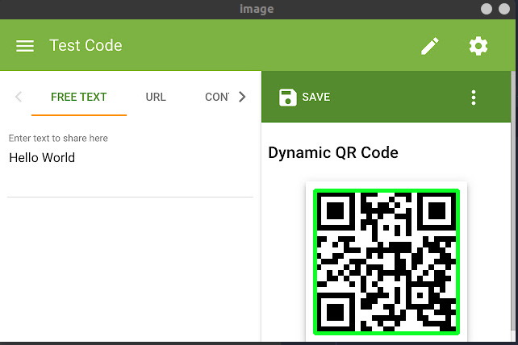

# QR Code parser  
### *Made by `George Khutsurauli and Vova Borovoi`*  
#### Technologies used:  
- `Python 3.8`  
- `CV2` library  
- Standard image library  
#### This QR parser shows highlited QR code and prints out the parameters of QR code location (x, y, width, height)  
#### Examples of Usage:  
  

*(C) Only for personal and educational usage*
